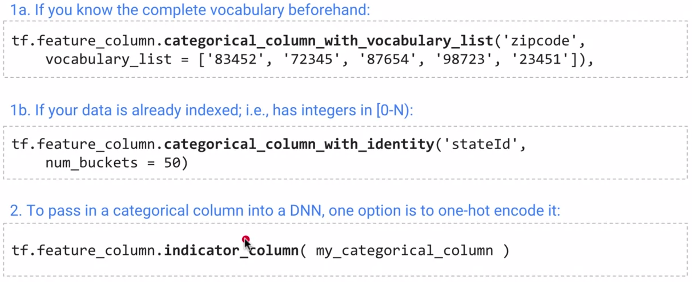
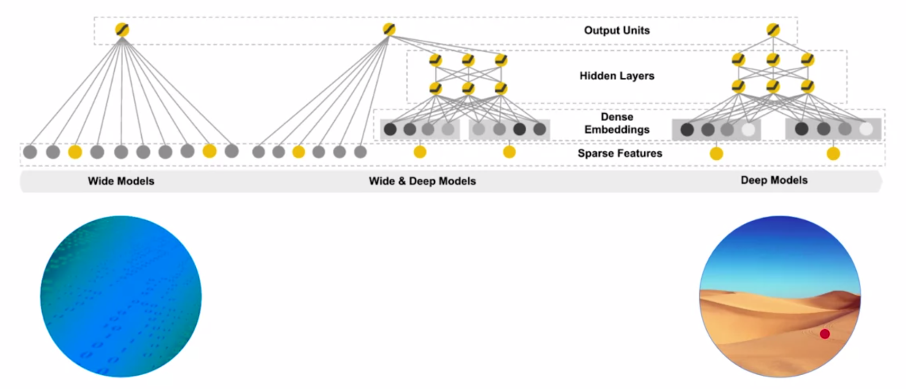

# Google Cloud Platform guide

Steps to set up fresh project workspace.

## Create Storage Bucket


## Launch AI Platform Notebooks

#### Step 1

Click on **Navigation Menu**. Navigate to **AI Platform**, then to **Notebooks**.


#### Step 2

On the Notebook instances page, click . Create the environment configuration that we want. Specify Region and zone, GPU and RAM configurations in the **CUSTOMIZE** settings.


#### Step 3

Click **Open JupyterLab**. A JupyterLab window will open in a new tab


From here, you will have a **Jupyter notebook environment** set-up and running in GCP. Of course, we can clone our existing notebooks(e.g. from *github*) into this workspace.

## Exploratory Data Analysis (EDA)

When working with large datasets, it’s usually not idea to have everything stored in the local PC. What can easily do in this situation is to use **SQL** to load our data of interest into a *Pandas DataFrame* with limited volume(say only 200 entries.)


We can investigate our dataset using a portion of our data. Of course, in reality, we should a bigger volume and make sure to randomly sample them in order to obtain a close estimation of true distribution.

Next up, we can create a handy function that allows us to run **SQL** queries on the entire dataset retrieving only the information that we want to investigate. This helps us to build an intuition of how different **features** correlates with our dependent variable, thus allow us to have a good understanding when choosing the right feature to build our dataset/model later on.

```python
# Create a function that finds any one of the feature's corelation with average weight and number of babies
def get_distinct_values(column_name):
    # {0} refers to the first input variable. In this case, "column_name"
    # This happens because the .format() at the end
    query = """
    SELECT
        {0},
        COUNT(1) AS num_babies,
        AVG(weight_pounds) AS avg_wt
    FROM
        publicdata.samples.natality
    WHERE
        year>2000
    GROUP BY
        {0}
    """.format(column_name)
    return pd.io.gbq.read_gbq(query, project_id=project_id, dialect='standard')
```

For instance, we take take a look at the co-relation between the `mother_age` and `num_babies` & `avg_wt`.


and also theco-relation between the `plurality` and `num_babies` & `avg_wt`.


## Creating our dataset

#### Criterion of a good feature

When creating a dataset for our machine model, we don’t have to use all of the features comes with the original source. We have the freedom to pick the most “relevant” features or to compose new one based on old features, both of these two steps might have a positive impact on our model’s performance.

What *features* should we consider to incorporate:

*   Be related to the **objective**

*   Be known at **prediction-time**
*   Be **numeric** with meaningful magnitude(or we should do the feature engineering for conversion)
*   Have enough examples
*   Bring human insight to the problem

#### `FARM_FINGERPRINT(value)`

This is a **Hash Function** in SQL that takes in a value(such as a *date* or a *string*) and computes the *fingerprint* of it(output format is **hashed numeric type**. *The output of this function for a particular input will never change*. Which means, `FARM_FINGERPRINT('26-jan-2012')` is always going to return the same value whenever we call.(and it’s different from calling on all other values)

Here is a example of usage:

```sql
#standardSQL
SELECT
	data,
	airline,
	departure_airport,
	departure_schedule,
	arrival_airport,
	arrival_delay
FROM
	`bigquery-samples.airline_ontime_data.flights`
WHERE
	MOD(ABS(FARM_FINGERPRINT(date)),10)<8
```

The last line, would give us **randomly** sampled 80% of data. In addition, we can assign `MOD(ABS(FARM_FINGERPRINT(date)),10)=8` to **valid_set** and `MOD(ABS(FARM_FINGERPRINT(date)),10)=9` to **test_set**, so that we have a randomly spitted 80%-10%-10% dataset where **the same date will not appear in different set bracket** so as to avoid data leakage.

Here is another trick: when dealing with large datasets, we should always be prototyping on a small(randomly sampled) fraction of the entire dataset so that we can iterate fast. Once we have finalized the model design then we deploy the model on the entire original dataset. `RAND()` can easily help us to do just that:

```SQL
#standardSQL
SELECT
	data,
	airline,
	departure_airport,
	departure_schedule,
	arrival_airport,
	arrival_delay
FROM
	`bigquery-samples.airline_ontime_data.flights`
WHERE
	MOD(ABS(FARM_FINGERPRINT(date)),10)<8 AND RAND() < 0.01
```

The `RAND()` will generate a random number between `0` and `1` each time, and we are only keeping the query data if the value is smaller than 0.01 which means it’s a 1% chance. Hence, we are getting 1% of the entire dataset.

## Structure of an Estimator API ML model in Tensorflow

**Part 1**: creating model with specified features

```python
import tensorflow as tf
# Define input feature  columns
featcols = [tf.feature_column.numeric_column("feat_1"),
            tf.feature_column.categorical_column_with_xxx("feat_2"),
            tf.feature_column.embedding_column("feat_3")]

# Instantiate linear Regression model
model = tf.estimator.LinearRegressor(featcols, './your_model_saving_destination')
```

Two things are important here, specify the type of features that we are incorporating into our model, and the type of model that we are building (classification/regression).

**Part 2**: creating training loop

```python
# Train
def train_input_fn():
    # something is happening here
    return features, labels

model.train(train_input_fn, steps=100) 
```

The `train_input_fn()` is similar to **PyTorch** `DataLoader` that will fetch pairs of (input, output) for us. The `steps` parameter determines the number of step to perform with our optimizer.

**Part 3**: after training the model, we can perform inference

```python
# Predict
def pred_input_fn():
    # something is happening here
    return features
out = model.predict(pred_input_fn)
```

Similarly, we have a `pred_input_fn()` here plays the role of `Test_Dataloader`.

#### Supply categorical data to DNNs

**Choice 1**: use `One-hot encoding`:

First build the feature_column into **either** `vocabulary_list` or `identity` depending on whether we know the full set of all of the possible categories beforehand or not.

Secondly, put the categorical column into a `indocator_column` wrapper, so that it’s **one-hot-encoded** and can be accepted by a DNN



**Choice 2**: use a `embedding layer`:

```python
tf.feature_column.embedding_column(
    categorical_column,
    dimension,
    combiner='mean',
    initializer=None,
    ckpt_to_load_from=None,
    tensor_name_in_ckpt=None,
    max_norm=None,
    trainable=True
)
```

#### Write an input function that is capable of reading and parsing CSV.files

```python
# Create dataset with TextLineDataset function and apply 'decode_csv' function on every entry
dataset = tf.data.TextLineDataset(filename).map(decode_csv)

CSV_COLUMNS = ['feat_1','feat_2','feat_3',...]
LABEL_COLUMN = 'feat_3'
DEFAULTS = [[0.].['na'],[0.]]


def decode_csv(value_column):
    columns = tf.decode_csv(value_column, record_defaults=DEFAULTS)
    features = dict(zip(CSV_COLUMNS, columns))
    label = features.pop(LABEL_COLUMN)
    return feature, label
```

The above is a similar process to **PyTorch**‘s creating train_ds/valid_ds. The `decode_csv` file is responsible of returning our `(input, label)` pair.

To continue, we make use of this dataset and build the `Data_Loader`:

```python
# The data_loader should wrape the data_set function

CSV_COLUMNS = ['feat_1','feat_2','feat_3',...]
LABEL_COLUMN = 'feat_3'
DEFAULTS = [[0.].['na'],[0.]]

# the mode decides for training/testing
def dataset_loader(filename, mode, batch_size=512):
    # define the function to read CSV and return (input, output) pair
    def decode_csv(value_column):
        columns = tf.decode_csv(value_column, record_defaults = DEFAULTS)
        features = dict(zip(CSV_COLUMN, columns))
        label = feature.pop(LABEL_COLUMN)
        return features, label
    
    # actually creat the dataset
    dataset = tf.data.TextLineDataset(filename).map(decode_csv)
    
    # If training
    if mode == tf.estimator.ModeKeys.TRAIN:
        num_epochs = None # which mean train indefinitely
        dataset = dataset.shuffle(buffer_size = 10*batch_size)
    # if testing
    else:
        num_epochs = 1 # read the data just once
    dataset = dataset.repeat(num_epochs).batch(batch_size)
    
    return dataset.make_one_shot_iterator().get_next()
```

Now we have created a “DataLoader” that takes in a `filename` `training/testing` mode, `batch_size` and will return an **iterator** that fetches our data.

```python
estimator = tf.estimator.LinearRegressor(model_dir=output_dir,
                             			 feature_columns=feature_cols)

# This method does distributed training and evaluate periodically. It also creates checkpoint files and save summaries for TensorBoard
tf.estimator.train_and_evaluate(estimator,
                                train_spec,
                                eval_spec)
```

That is the last step of get your system running. As for the input of the `train_and_evaluate` function:

```python
# estimator is the model we created

#train_spec
train_spec=tf.estimator.TrainSpec(input_fn=dataset_loader('gs://.../train*',                                           mode=tf.contrib.learn.ModeKeys.TRAIN),
    							  max_steps=num_train_step)

# eval_spec
exporter = ...
eval_spec=tf.estimator.EvalSpec(input_fn=dataset_loader('gs://.../valid*',                                            mode=tf.contrib.learn.ModeKeys.EVAL),
                                steps=None,
                                start_delay_secs=60, # start evaluating after N seconds
                                throttle_secs=600,  #evaluate every N seconds
                                exporters=exporter)
```


### Wide-and-deep models in TensorFlow



In TensorFlow high-level `estimator` API, we have `wide_models` which are essentially **linear models**. `deep_models` are essentially a **MLP**. So the idea is, if we have both **numerical features** and **categorical features** that are *one-hot-encoded*, we should take advantage of the **Wide & Deep Models**.

In **Wide & Deep Models** the **categorical features** are fed directly into the last “dense layer” where the **numerical features & embedding layers** are passed through an **MLP** before reaching the output dense layer. Here is how it’s implemented in code:

```python
model = tf.estimator.DNNLinearCombinedClassifier(
                                            model_dir=...,
                                            linear_feature_columns=wide_columns,
                                            dnn_feature_columns=deep_columns,
                                            dnn_hidden_units=[100,50] # hidden neurons in each layer)
```


