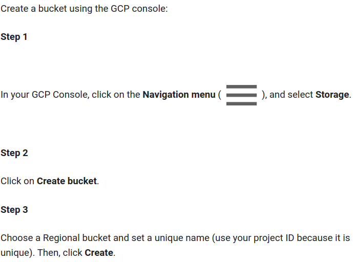
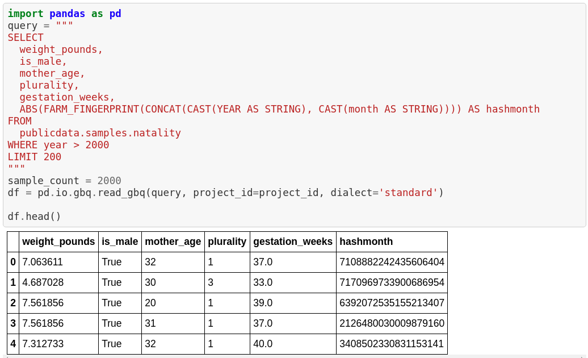
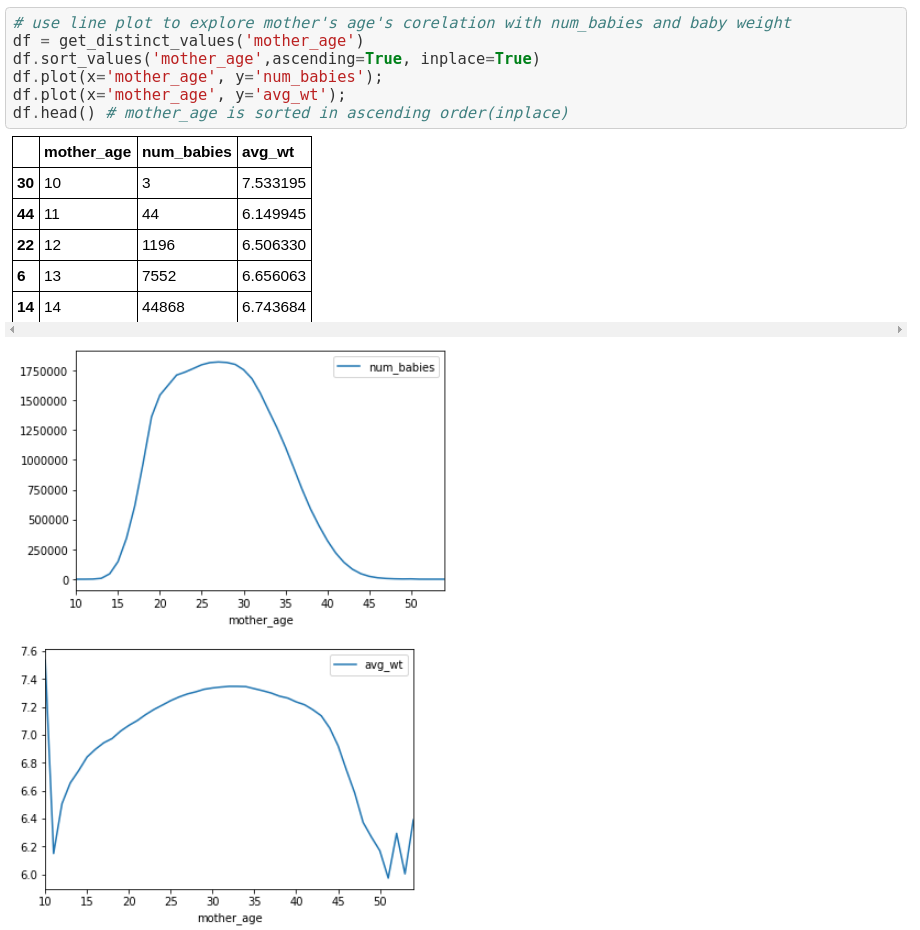
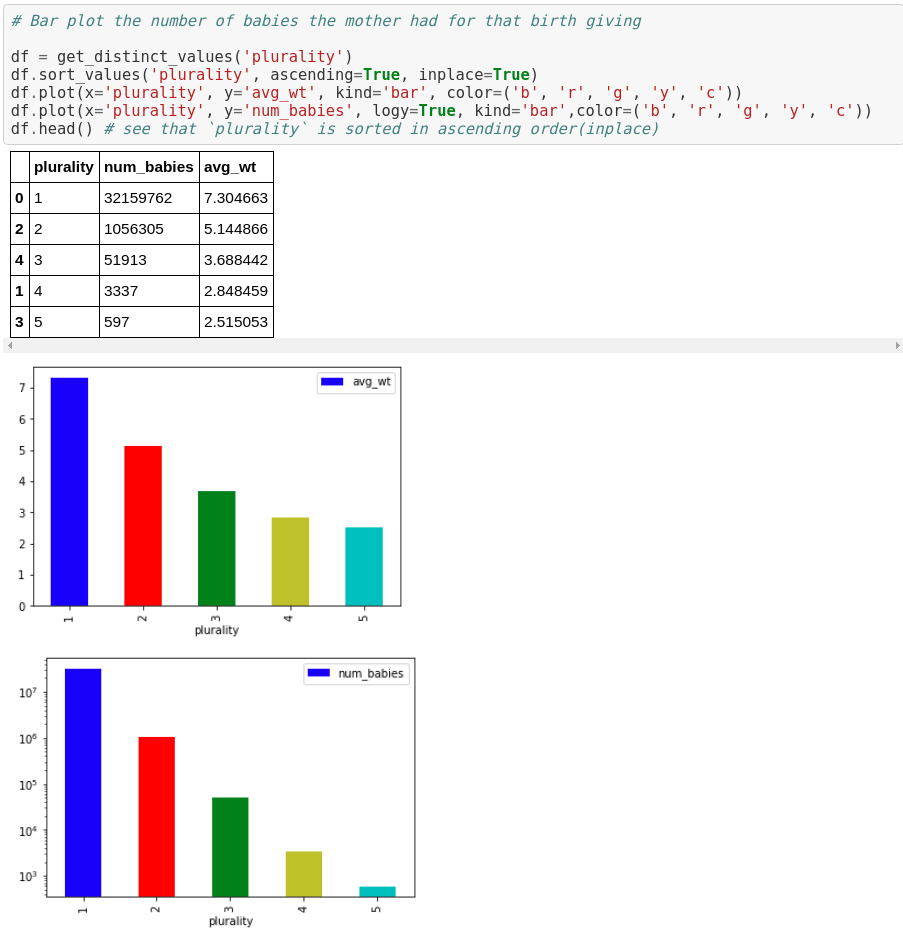

# Google Cloud Platform guide

Steps to set up fresh project workspace.

## Create Storage Bucket



## Launch AI Platform Notebooks

#### Step 1

Click on **Navigation Menu**. Navigate to **AI Platform**, then to **Notebooks**.


#### Step 2

On the Notebook instances page, click . Create the environment configuration that we want. Specify Region and zone, GPU and RAM configurations in the **CUSTOMIZE** settings.


#### Step 3

Click **Open JupyterLab**. A JupyterLab window will open in a new tab


From here, you will have a **Jupyter notebook environment** set-up and running in GCP. Of course, we can clone our existing notebooks(e.g. from *github*) into this workspace.

## Exploratory Data Analysis (EDA)

When working with large datasets, it’s usually not idea to have everything stored in the local PC. What can easily do in this situation is to use **SQL** to load our data of interest into a *Pandas DataFrame* with limited volume(say only 200 entries.)



We can investigate our dataset using a portion of our data. Of course, in reality, we should a bigger volume and make sure to randomly sample them in order to obtain a close estimation of true distribution.

Next up, we can create a handy function that allows us to run **SQL** queries on the entire dataset retrieving only the information that we want to investigate:

```python
# Create a function that finds any one of the feature's corelation with average weight and number of babies
def get_distinct_values(column_name):
    # {0} refers to the first input variable. In this case, "column_name"
    # This happens because the .format() at the end
    query = """
    SELECT
        {0},
        COUNT(1) AS num_babies,
        AVG(weight_pounds) AS avg_wt
    FROM
        publicdata.samples.natality
    WHERE
        year>2000
    GROUP BY
        {0}
    """.format(column_name)
    return pd.io.gbq.read_gbq(query, project_id=project_id, dialect='standard')
```

For instance, we take take a look at the co-relation between the `mother_age` and `num_babies` & `avg_wt`.



and also theco-relation between the `plurality` and `num_babies` & `avg_wt`.



