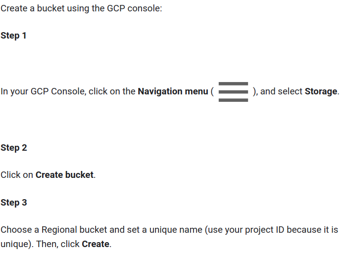

# Google Cloud Platform guide

Steps to set up fresh project workspace.

## Create Storage Bucket

## Launch AI Platform Notebooks

#### Step 1

Click on **Navigation Menu**. Navigate to **AI Platform**, then to **Notebooks**.

#### Step 2

On the Notebook instances page, click . Create the environment configuration that we want. Specify Region and zone, GPU and RAM configurations in the **CUSTOMIZE** settings.

#### Step 3

Click **Open JupyterLab**. A JupyterLab window will open in a new tab

From here, you will have a **Jupyter notebook environment** set-up and running in GCP. Of course, we can clone our existing notebooks(e.g. from *github*) into this worksapce.